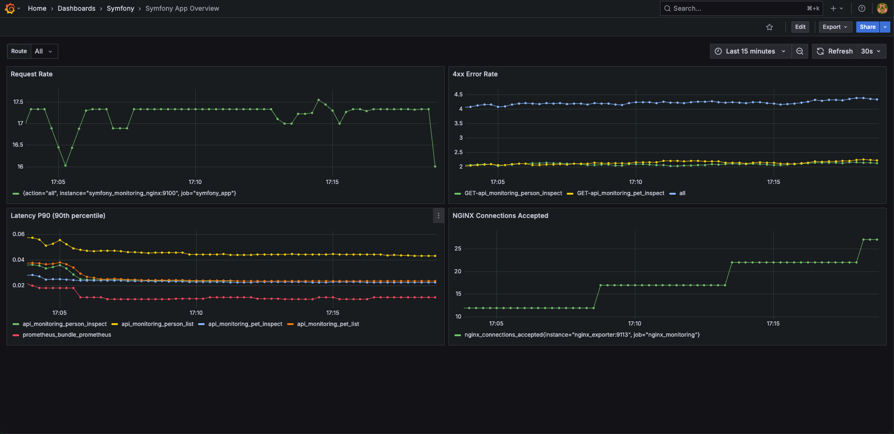

# Symfony API Monitoring

This project demonstrates how to instrument a php symfony backend service with Prometheus for metrics and unified in Grafana.

### Why This Project?

* During my recent DevOps work with Prometheus, Loki, Grafana, OpenTelemetry, and related tools, I fell in love with real-time observability. 
* As a php developer, I wanna also try to instrument my api with modern monitoring stacks and provide my solution, which everyone can use.
* This demo shows an end‑to‑end setup: from instrumenting code to visualizing metrics in Grafana.

## Project Overview

* **Simple RestAPI created by symfony**: Provide a simple rest api
* **k6**: Runs a JavaScript load test (load-test.js) against all endpoints and generates both successful (IDs 1–5) and 404 (IDs 6–10) requests so Prometheus captures error rates.
* **Nginx-exporter**: Scrapes http://nginx/nginx_status on port 9113 and exposes Nginx metrics (connections, requests, etc.) under /metrics.
* **Prometheus**: Scrapes metrics from backend service. Runs at `:9099`.
* **Grafana**: Auto‑imports a dashboard that shows backend metrics. Accessible at `http://localhost:3005`.

## Repository Structure

```
├── docker/
│   ├── nginx/
│   │   ├── default.conf           ← Nginx config (HTTPS + metrics + stub_status)
│   │   └── certs/                 
│   │       ├── server.crt         
│   │       └── server.key         
│   └── php/
│       └── Dockerfile            ← `php:8.4-fpm` + Symfony CLI + Composer
├── monitoring/
│   ├── prometheus/
│   │   └── prometheus.yml         ← Prometheus scrape config
│   ├── grafana/
│   │   └── provisioning/
│   │       ├── dashboards/        ← JSON dashboards (auto-import)
│   │       └── datasources/       ← Prometheus as data source
│   └── loadtests/
│       └── load-test.jsx          ← k6 script calling `/person` & `/pet`
├── symfony_monitoring/            ← Symfony application root
│   ├── config/
│   │   ├── packages/
│   │   │   ├── prometheus_metrics.yaml  ← ArtprimaPrometheusMetricsBundle config
│   │   │   └── ...                      
│   │   └── routes/
│   │       └── metrics.yaml                 
│   ├── public/
│   │   └── index.php                      ← Symfony front controller
│   ├── src/
│   │   ├── Controller/
│   │   │   ├── PersonController.php
│   │   │   └── PetController.php
│   │   ├── Dto/
│   │   │   ├── PersonDto.php
│   │   │   └── PetDto.php
│   │   └── EventSubscriber/
│   │       └── Prometheus/
│   │           └── MetricsSubscriber.php
│   ├── .env
│   ├── composer.json
│   └── ...  
├── docker-compose.yaml
└── README.md                    ← (You are here)
```

## Before you start

Please create self-signed certs for nginx:

```bash
mkdir -p docker/nginx/certs

openssl req -x509 -nodes -days 365 -newkey rsa:2048 \
-keyout docker/nginx/certs/server.key \
-out docker/nginx/certs/server.crt \
-subj "/C=DE/ST=NRW/L=Duesseldorf/O=Dev/CN=localhost"`
```

## After you create the certs for nginx:

Simply run `docker compose up -d`, then go to Grafana dashboard `localhost:3005` with default user: **admin** with password: **admin**, then you will see the graphs.

The k6 load script is set to run 20 min. You can either monitor the status in real-time or just wait 20 min to see the results.

## Symfony Instrumentation (ArtprimaPrometheusMetricsBundle)

I use **ArtprimaPrometheusMetricsBundle** to expose metrics from Symfony. Then Prometheus scrapes `/metrics/prometheus`.

### Install & Configure the Bundle

1. **Require via Composer**:
```bash
composer require artprima/prometheus-metrics-bundle
```
2. **Create config/packages/prometheus_metrics.yaml**:

```yaml 
artprima_prometheus_metrics:
    # Use APCu storage for in-memory metrics
    # (alternatively: "redis", "in_memory", "filesystem", etc.)
    dsn: '%env(PROM_METRICS_DSN)%'
    # Only collect HTTP request metrics; you can add custom collectors if needed
    enable_http_collector: true
    # Optionally: service name to prefix metrics
    namespace: 'symfony_app'
```

3. **Add environment variable in .env:**
```bash
###> artprima/prometheus-metrics-bundle ###
PROM_METRICS_DSN=apcu
###< artprima/prometheus-metrics-bundle ###
```

This tells the bundle to store counters/histograms in APCu (so PHP must have apcu enabled).

4. **Register MetricsSubscriber**

By default, Artprima’s bundle can auto-collect HTTP metrics. But if you want more control (e.g., histogram of request durations with labels [method, route, status]), add a custom subscriber:

```php
<?php

declare(strict_types=1);

namespace App\EventSubscriber\Prometheus;

use Prometheus\CollectorRegistry;
use Prometheus\Exception\MetricsRegistrationException;
use Prometheus\Histogram;
use Symfony\Component\EventDispatcher\EventSubscriberInterface;
use Symfony\Component\HttpKernel\Event\RequestEvent;
use Symfony\Component\HttpKernel\Event\TerminateEvent;
use Symfony\Component\HttpKernel\KernelEvents;

class MetricsSubscriber implements EventSubscriberInterface
{
    private Histogram $histogram;
    private array $startTimes = [];

    /**
     * @throws MetricsRegistrationException
     */
    public function __construct(private readonly CollectorRegistry $registry)
    {
        $this->histogram = $this->registry->getOrRegisterHistogram(
            'symfony_app',
            'http_request_duration_seconds',
            'HTTP request duration in seconds',
            ['method', 'route', 'status']
        );
    }

    public static function getSubscribedEvents(): array
    {
        return [
            // capture start time before controller executes
            KernelEvents::REQUEST   => ['onKernelRequest', 100],
            // observe duration after response is sent
            KernelEvents::TERMINATE => ['onKernelTerminate', 0],
        ];
    }

    public function onKernelRequest(RequestEvent $event): void
    {
        if (! $event->isMainRequest()) {
            return;
        }
        $req = $event->getRequest();
        $this->startTimes[spl_object_id($req)] = microtime(true);
    }

    public function onKernelTerminate(TerminateEvent $event): void
    {
        $req = $event->getRequest();
        $res = $event->getResponse();
        $id  = spl_object_id($req);

        $start = $this->startTimes[$id] ?? null;
        unset($this->startTimes[$id]);

        if ($start === null) {
            return;
        }

        $duration = microtime(true) - $start;
        $route    = $req->attributes->get('_route', 'n/a');
        $method   = $req->getMethod();
        $status   = (string) $res->getStatusCode();

        $this->histogram->observe($duration, [$method, $route, $status]);
    }
}
```

5. **Register this subscriber as a service in config/services.yaml**:
```yaml
services:
  App\EventSubscriber\Prometheus\MetricsSubscriber:
    arguments:
      $registry: '@Prometheus\CollectionRegistry'
    tags:
      - { name: 'kernel.event_subscriber' }
```

## View Grafana dashboard



## Final words

Modern observability stacks are incredibly powerful and ever-evolving. I’m excited to continue learning about Prometheus, Grafana, Jaeger, OpenTelemetry, and other tools to build even more robust systems.

I’ve enjoyed working with PHP and Symfony because of its elegant structure and rapid development capabilities, but I also realize that modern applications need robust observability; therefore, I want to integrate a full monitoring stack (Prometheus, Grafana, etc) to gain real-time insights and build more resilient systems.
## Further Reading

* [Prometheus](https://prometheus.io/docs/)
* [Grafana](https://grafana.com/docs/)
* [Artprima Prometheus Metrics Bundle](https://github.com/artprima/prometheus-metrics-bundle)
* [k6 Load Testing](https://k6.io/docs/)
* [NGINX Prometheus Exporter](https://github.com/nginxinc/nginx-prometheus-exporter)

Feel free to explore these official resources to deepen your understanding of modern monitoring and observability tools.

Happy monitoring!😎
